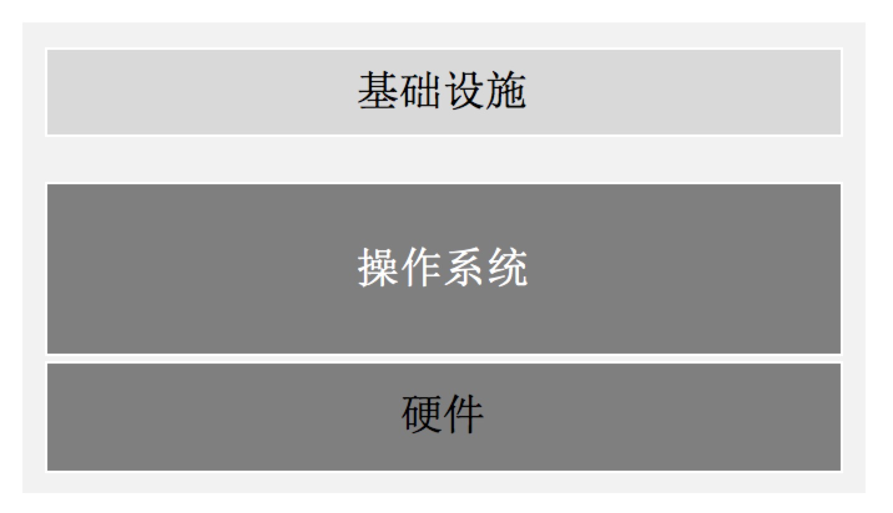

> 各位好，我是希云cSphere技术总监张春源；今天和大家分享一下为何会选择容器技术来构建持续交付/持续发布系统。

# 利用容器技术构建持续交付/持续发布系统

## 概述

提到软件发布确实是很令人头疼的一个过程，且还是高风险动作。借用王总的一句话：“99%的故障是由于变更引起的”。本次分享内容着重介绍使用容器技术实现自动化构建、部署和测试过程，并使得开发、测试、运维之间能更好的协作，最终可以在几个小时甚至几分钟的时间，实现可重复，且可靠的软件发布系统。

## 常见场景

- 在开发测试环境中测试均没有问题，但上生产环境的时候会有问题。即使我们在开发测试环境中部署上万遍没问题，但从来没有在生产环境中部署过一次，每到在新版本发布时，大家不仅要加班，而且都还很紧张。如果没有很好的回滚策略，即使发布成功了心还是悬着。

- 移动互联网飞速发展，业务要求敏捷，要在很短的时间完成从开发到上线的任务。很多企业从开发到上生产的周期都要花好几个月的时间完成，现有IT架构跟不上业务发展。

- 软件项目开发完成后，要将开发好的版本交付到客户的环境中。目前常见的做法是按照长长的安装文档，且是通过手动安装完成，此种模式不仅对安装实施人员的要求高，且出错几率很高。

## 构建持续交付/持续发布系统需要考虑

- 环境管理

环境包括硬件和软件，对于软件环境一定要能对硬件解耦，这样即使在硬件坏的情况下可以在很短的时间内将软件环境部署到新的硬件上。除此之外，好的环境管理方式能有效降低在生产环境中部署的风险。

***实践推荐：环境的管理在项目开始的时候，开发团队和运维团队就应该全面合作，后面的事情就会并的很容易。**

- 组件和依赖管理

- 配置管理
- 版本管理
- 持续交付管理

问题越早发现修复起来的成本越低，且更好地保证成功的发布上线。

## 为何选择使用容器

以Docker为代表的容器技术，在短短的时间内发展迅速。容器技术早在2008年已经出现，Docker公司最大的价值是提供了将软件运行环境打包的技术-**镜像**。

很多不标准化的交付使用镜像的可以实现标准化。标准化后可以更好的实现自动化，并且能更好的促进上游和下游的发展。如：开发，测试，运维之间可以更好的协助，践行DevOps文化。

## 持续交付实践

**原则：可重复、可靠；自动化化；版本控制；团队责任；**

**交付**涉及到*操作系统*、*服务运行环境*、*配置文件*、*代码版本*等。

系统部署在开发或生产环境中，有些配置会发生变化。根据*变*或*不变*来区分，不变的有*操作系统*、*代表版本*；变化的有*服务运行环境*、*配置文件*。

可靠的交付流程应该将*操作系统*、*服务运行环境*、*配置文件*、*代码版本*、*服务依赖*等信息打包，然后整体交付。

*推荐：

利用容器实现的持续交付流程如下：

注解：

1.
2.
3.
4.
5.
6.
7.

## 持续发布实践

### 常见的发布模式

